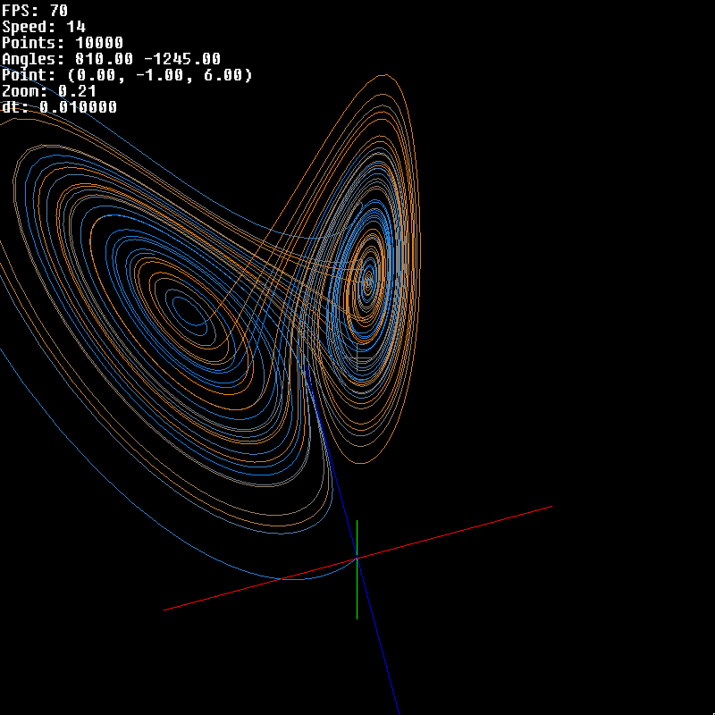

# Dynamical Systems

A C program for visualizing continuous time dynamical systems in a 3D space.

## Features

- 3D plotting
- customizable input equations
- mouse and keyboard controls for the 3D plot

## Installation
### Dependencies
- cglm
- freetype
- gmp
- GLEW
- GLFW3
- OpenGL
- lizard
- ds

### With Nix
```shell
nix build
```

### With Make
```shell
make
```

## Usage
```shell
./dynsys
```

### Controls
- `w`,`a`,`s`,`d`: camera angle
- `-`,`=`: zoom
- `z`: toggle cross
- `x`: toggle axis
- `c`: clear/reset
- `spacebar`: pause/resume
- `m`,`,`: speed decrease
- `.`,`/`: speed increase
- `j`,`l`: x translation
- `i`,`k`: y translation
- `p`,`;`: z translation
- `v`, `b`: dt



Note: __at the moment__ the input equation must be provided in Polish notation:
```
Lorenz attractor:
dx: ( * 10 (- y x))
dy: ( - (* x (- 28 z)) y)
dz: ( - (* x y) (* (/ 8 3) z))

Rössler attractor:
dx: ( - 0 ( + y z))
dy: ( + x ( * (/ 1 5) y))
dz: ( + (/ 1 5) ( * z ( - x (/ 57 10))))
```
## Contributing

Contributions are welcome! Before submitting a pull request, please:
- Format your code with clang-format
- Test your code for memory leaks and undefined behavior with valgrind
