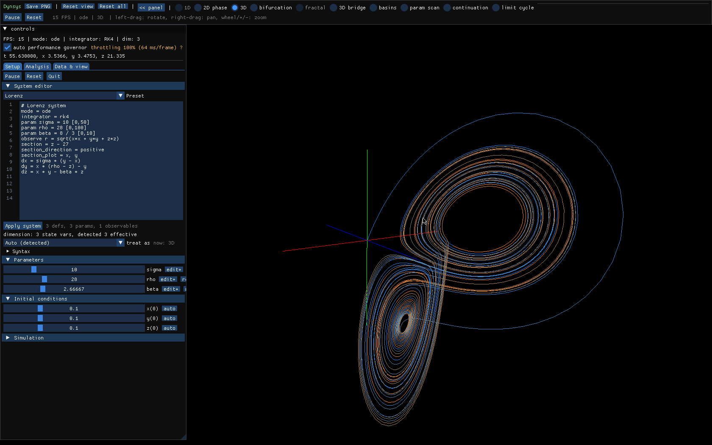

# dynsys

An interactive visualizer and analyzer for dynamical systems — phase portraits,
attractors, basins of attraction, and continuation/bifurcation analysis aimed at
MatCont-style parity — built in C++17 on Dear ImGui + GLFW/OpenGL, with an
optional exact-symbolic (CAS) path.

You describe a system of ODEs or a map in a small `.dyn` text format; dynsys
renders the flow, finds and classifies equilibria, traces limit cycles,
continues bifurcations in one and two parameters, locates and continues codim-2
points, solves homoclinic/heteroclinic connections, and — when the CAS bridge is
available — computes exact eigenvalues and certified derivatives.



## Features

**Phase-space visualization**
- 2-D phase portraits with orbits, nullclines, flow-direction arrows, and a
  speed-colored vector field.
- 3-D attractor view with interactive rotate/pan/zoom.
- Poincaré sections with configurable crossing direction.
- Discrete maps and iterated function systems (IFS) in addition to ODE flows.

**Equilibria & local analysis**
- Automatic equilibrium finding with linear classification (node/saddle/focus/
  center, stability) and stable/unstable manifolds.
- Eigenvalues, Jacobians (finite-difference), determinants.

**Continuation & bifurcations (codim-1)**
- Equilibrium continuation with fold, Hopf, and branch-point detection, plus
  branch switching.
- First Lyapunov coefficient (Hopf criticality); fold and cusp normal forms.

**Codim-2**
- Two-parameter fold and Hopf curves with codim-2 detection: Bogdanov-Takens,
  cusp, generalized-Hopf (Bautin), zero-Hopf (fold-Hopf), and Hopf-Hopf —
  each with its normal-form coefficients.
- Direct codim-2 point location (Bogdanov-Takens), and continuation of the BT,
  zero-Hopf, cusp, and Hopf-Hopf loci as curves in a third parameter.

**Limit cycles**
- Limit-cycle continuation by orthogonal collocation + pseudo-arclength with an
  adaptive mesh, and Floquet multipliers.
- Cycle bifurcation curves: fold-of-cycles (LPC), period-doubling (PD), and
  Neimark-Sacker (NS); branch-point-of-cycles.

**Global connections**
- Homoclinic and heteroclinic orbit solving and continuation, including a
  seed-by-integration helper, a defining-system locator, and a Lin's-method
  path for homoclinic detection.

**Invariants & chaos**
- Lyapunov spectrum and Kaplan-Yorke (Lyapunov) dimension.
- Basins of attraction (single-threaded and parallel/deterministic) and
  fractal/escape-time renders.
- Box-counting (fractal) dimension.

**Exact-symbolic path (optional CAS bridge)**
- When the `lizard` interpreter and the Sangaku CAS are available, eigenvalues,
  equilibria, and derivatives can be computed symbolically; the bridge degrades
  gracefully to the numeric path when they are absent. See the note under
  *Dependencies* — this path is under active development.

**Headless mode**
- A `--headless` runner for batch integration, differential testing, and
  benchmarking without opening a window.

## Build

Dependencies are provided **entirely through the Nix flake** — Dear ImGui, GLEW,
GLFW, cglm, the OpenGL/X libraries, the TPCAS parser frontend, and the Lizard +
Sangaku CAS. The repository vendors no third-party source itself.

```sh
nix develop        # dev shell; exports IMGUI_DIR, TPCAS_DIR, DS_CFLAGS/DS_LIBS, LIZARD, SANGAKU_ROOT
make               # builds build/dynsys
make run           # or ./build/dynsys
make clean
```

To build without the dev shell, supply the same variables by hand (the Makefile
checks they are set and errors with a hint otherwise):

```sh
make IMGUI_DIR=/path/to/imgui TPCAS_DIR=/path/to/tpcas \
     DS_CFLAGS=-I/path/to/ds/include DS_LIBS='-L/path/to/ds/lib -lds'
```

### Windows cross-build

```sh
nix develop .#windows    # MinGW-w64 cross toolchain + static GLFW/GLEW
make windows             # -> build/windows/dynsys.exe
```

## Dependencies

dynsys is built on a small stack of the author's own libraries, sourced through
the flake:

- **[tpcas](https://github.com/hydrastro/tpcas)** — the typed parser used to read
  `.dyn` expressions. It links against **[ds](https://github.com/hydrastro/ds)**,
  a data-structures library, which the flake supplies as a package (`-lds`).
- **[lizard](https://github.com/hydrastro/lizard)** + **[sangaku](https://github.com/hydrastro/sangaku)**
  — the exact-symbolic (CAS) backend. The `cas_bridge` shells out to the
  `lizard` binary with Sangaku on the module path.

> **Note on lizard / sangaku.** Lizard is under heavy, active development and
> Sangaku depends on it, so the exact-symbolic path may change in radical ways.
> The CAS bridge is intentionally decoupled (dynsys talks to the `lizard` binary
> through a thin bridge and degrades to the numeric path if it is missing or its
> interface shifts), so the core numeric features keep working regardless. Expect
> the CAS surface to evolve.

## Run

```sh
./build/dynsys                                               # interactive GUI
./build/dynsys --headless examples/lorenz.dyn --steps 10000 # headless integration
```

In the GUI the plot fills the window; controls are in the top toolbar and the
left panel. In 2-D phase view: left-click adds an orbit, left-drag pans, the
wheel (or `+`/`-`) zooms, double-click auto-fits. In 3-D view: left-drag
rotates, right-drag pans, the wheel zooms.

## The `.dyn` format

A system is a short text file. Example (`examples/lorenz.dyn`):

```
state x, y, z
mode = ode
integrator = rk4

param sigma = 10 [0,50]
param rho   = 28 [0,100]
param beta  = 8 / 3 [0,10]

plot3d = x, y, z
plot2d = x, z
observe r = sqrt(x*x + y*y + z*z)

section = z - 27
section_direction = positive
section_plot = x, y

initial x = 0.1
initial y = 0
initial z = 0

dx = sigma * (y - x)
dy = x * (rho - z) - y
dz = x * y - beta * z
```

`mode = ode` integrates a continuous vector field (`dx = ...` per state);
`mode = map` iterates a discrete map; `mode = ifs` runs an iterated function
system. Parameters take an optional `[lo,hi]` range used for the sliders and for
continuation. See `examples/` for maps (Hénon, Thomas), oscillators (Van der
Pol), predator-prey (Lotka-Volterra), and higher-dimensional systems.

## Tests

```sh
make test          # full smoke-test suite (numeric core)
make test-cas      # exact-symbolic (CAS) bridge tests; needs LIZARD + SANGAKU_ROOT
```

Each analysis feature is validated against analytic ground truth in the suite.

## Scope

dynsys is an independent tool, not a drop-in replacement for MatCont or AUTO. It
validates its analysis features against known-analytic systems, but it does not
claim their decades-long robustness track record. `docs/MATCONT_COMPARISON.md`
states honestly what is at rough parity and what remains.

## Documentation

See `docs/` for the MatCont comparison (`MATCONT_COMPARISON.md`), the CAS bridge
design (`PHASE_E_CAS_BRIDGE.md`), a worked example (`EXAMPLE_FOOD_CHAIN.md`),
the roadmap, and design notes.
